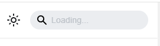

## 前言
从大学到现在一共换了很多博客
- CSDN：使用将近半年，多是一些笔记
- [My-Blog](https://github.com/ZHENFENG13/My-Blog)：没有使用过，但对其重新开发并加入到我的[毕设](../graduation-project)当中
- [NBlog](https://github.com/Naccl/NBlog)：使用将近两年，小而精美
- [个人博客系统](../vici-blog)：使用半年
  当然不止这些，期间还去玩过Hexo、Gitbook等等

## 为什么选择docusaurus
我们搭建博客的最基本诉求是什么？写、展示

而我自己实现的博客，前台实现了展示博客、动态、评论、个人信息，后台实现了博客、动态等等的编辑和存储。

然而，存在一些问题：
- 编辑：我们通常在idea、vscode上写，去后台只是为了复制上去然后上传
- 评论：很少使用的到。博客更多的是分析而非讨论，真有问题，邮箱联系即可，评论后台也是邮箱通知
- 数据存储：很多图片是额外存储的，发生意外没来的及备份就g了
- 展示：在前台中md转html的代码逻辑占比很小，大部分都是在完成其余组件

使用 docusaurus 可以做尽可能少的事，完成尽可能多的事情

docusaurus在build时就将所有指定文件夹下的md、mdx文件转化成html，那么也就是说我们只要编辑完成md文件就可以rebuild，实现网站刷新。
但是每次更新都要重新上传服务器肯定是不方便的，这时我们该想起git，在服务器上定时拉取，比较commit版本，确定是否rebuild，这样就可以简单的实现上传即发布了。

经过这样简单的配置后，我们只需要对项目进行更新，就直接发布，直接就完成了编辑、存储、展示功能，且有git的支持存储更加安全。
剩下一个评论的功能，实际上我们可以去掉他，毕竟不是刚需，如果想要的话也可以插件进行配置。

## 快速开始
[快速上手](https://docusaurus.io/)

### 配置导航
配置侧边栏
```js title='sidebars.js'
/**
 * Creating a sidebar enables you to:
 - create an ordered group of docs
 - render a sidebar for each doc of that group
 - provide next/previous navigation

 The sidebars can be generated from the filesystem, or explicitly defined here.

 Create as many sidebars as you want.
 */

// @ts-check

/** @type {import('@docusaurus/plugin-content-docs').SidebarsConfig} */
const sidebars = {
  // By default, Docusaurus generates a sidebar from the docs folder structure
  tutorialSidebar: [{type: 'autogenerated', dirName: '.'}],

  //可声明多个使用
  projectSidebar: [
    {
      type: 'autogenerated', // 表示顶级
      dirName: 'personal-project', // xx 实际路径是 ./docs/xx
    },
  ],

};

export default sidebars;
```
配置
```js title='docusaurus.config.js'
    themeConfig: ({
        //**
        navbar: {
            items: [
                // **
                {
                    type: 'docSidebar', // 表明是导航
                    sidebarId: 'projectSidebar', //侧边栏，对应自己的配置
                    label: '项目经验', // 导航栏显示名称
                    position: "left" // 左对齐
                },
            ]
        }
    })
```

### 配置代码高亮插件
默认情况下，不支持powershell、Java等等
需要添加以下配置
```jsx title='docusaurus.config.js'
    themeConfig: ({
        //**
        prism: {
            theme: prismThemes.github,
            darkTheme: prismThemes.dracula,
            additionalLanguages: ['java','powershell','lua','python','go'] //在这里面添加你想要的，shell有问题，不要配置了，会白屏无法访问
        },
    })
```

### 配置搜索
```shell
npm i docusaurus-lunr-search  --save
```
加载插件
```js title='docusaurus.config.js'
    plugins: [[ require.resolve('docusaurus-lunr-search'), {
        languages: ['en','zh'] // language codes
    }]]
```
如果需要配置成支持中文还需要添加 @node-rs/jieba依赖
```shell
npm install @node-rs/jieba
```
此插件需要打包生成索引才可生效，所以开发时会一直显示loading，打包运行就会回复正常。<br/>



## shell 定时脚本
```shell title='blog_rebuild_task.sh'
#!/bin/bash

git_repo_path="repository_path"

cd "$git_repo_path"

git pull

current_commit=$(git rev-parse HEAD)

previous_commit=$(cat .previous_commit 2>/dev/null)

blog_rebuild_log = "/tmp/blog_rebuild.log"

if [ -z "$previous_commit" ] || [ "$current_commit" != "$previous_commit" ]; then
  npm run build > "$blog_rebuild_log" 2>&1
  # 记录和更新
  echo "$(date '+%Y-%m-%d %H:%M:%S') - Ran npm run build" >> task.log
  echo "$current_commit" > .previous_commit

  # 邮件收件人地址
  recipient="your@email.com"
  # 邮件主题
  subject="rebuild error"
  # 邮件内容
  body="sb, rebuild error.msg is \n${cat "$blog_rebuild_log"}"

  # 使用 mail 命令发送邮件
  echo -e "$body" | mail -s "$subject" "$recipient"
else
  echo "Versions are the same"
fi
```

配置定时器
```shell
crontab -e
# 根据自己需要配置，因为博客对时延不敏感，脚本运行消耗不大,所以可以去一个宽松的时间
*/15 * * * * * /path/blog_rebuild_task.sh
```