## 前言
之前一直在使用<a href='https://naccl.top'>naccl</a>的<a href='https://github.com/Naccl/NBlog'>nblog</a>，这个博客是真的小而精美。

服务器ip密码泄漏啥都没有了，需要重新部署我的应用和博客，正好由于最近在学习前端，就想着自己实现一个博客来实践，原本打算后台用react，前台用vue的，结果vue写着感觉极不舒服，换成angular也不太舒服，最终整体的前端都用了react。
尝试自己设计但是很丑...所以整体风格抄的nblog

## 后端
- Spring Boot：核心框架
- Mybatis Plus：ORM框架
- Redis: 缓存数据，缩短接口响应时间、降低db压力
- MySQL：持久化存储数据

## 前台
- React：主题框架
- antd：整体组件UI
- axios：请求工具
- markdown-it：md文件转化html展示
- semantic：部分UI设置
- highlightjs：代码高亮
### 首页
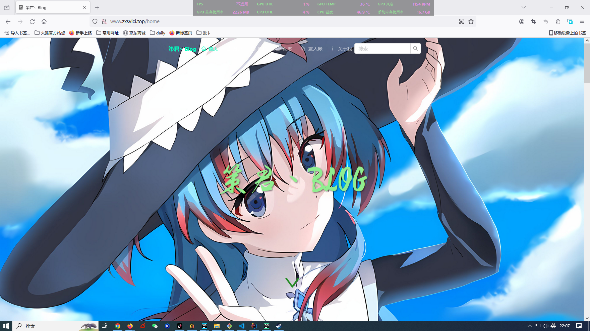
### 首页博客列表
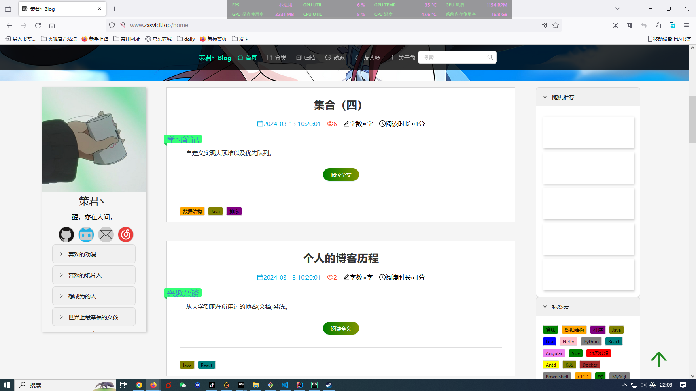
### 博客详情
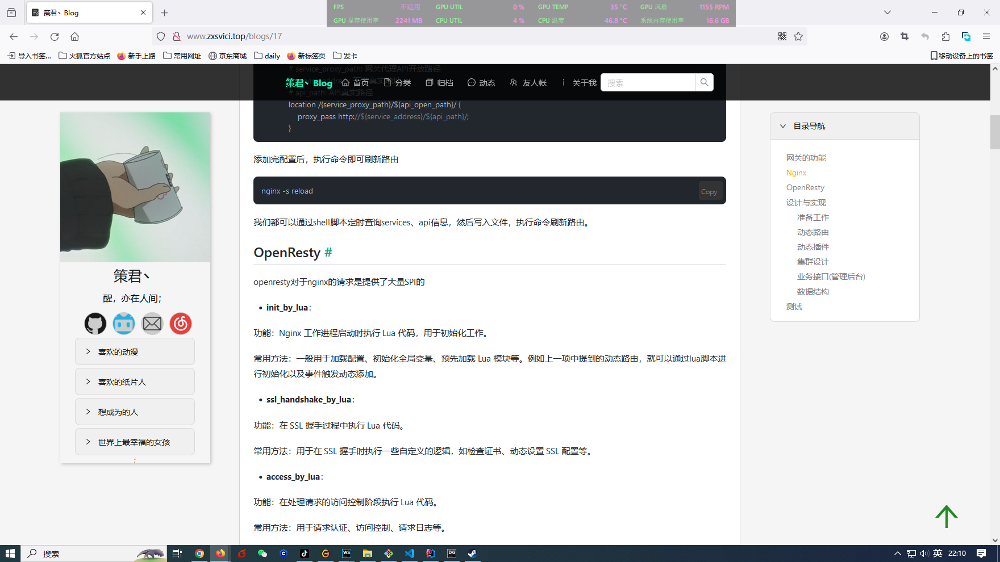
### 评论列表
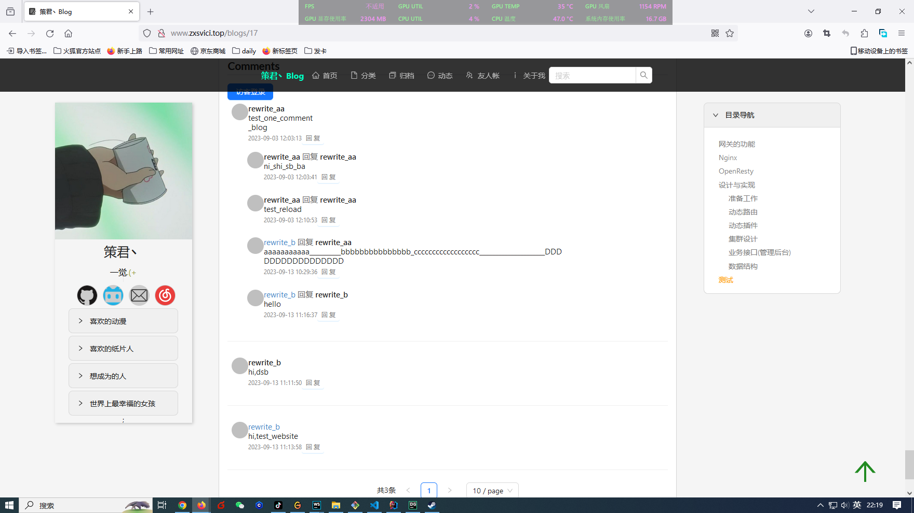
### 访客登录
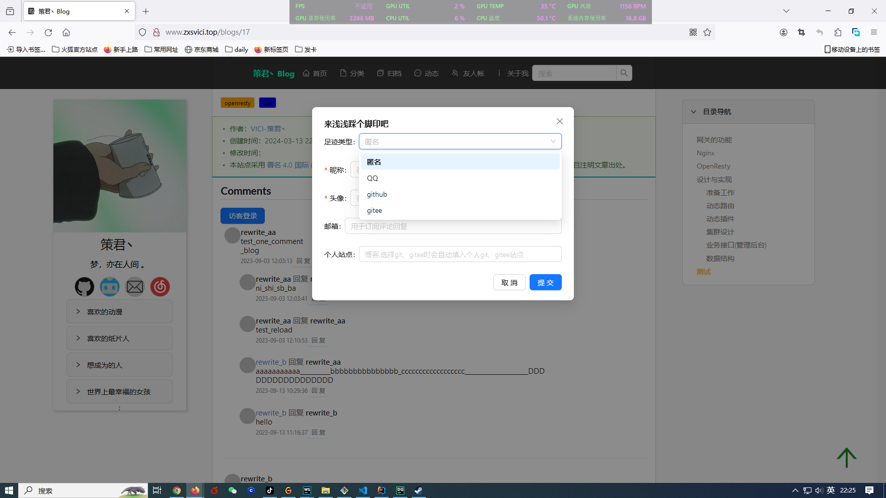
### 登录后评论
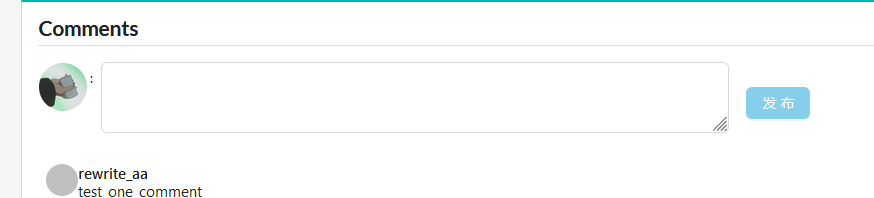
### 回复评论
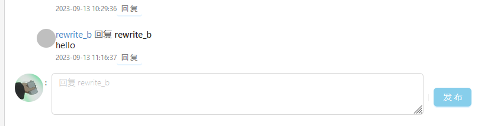
### 归档
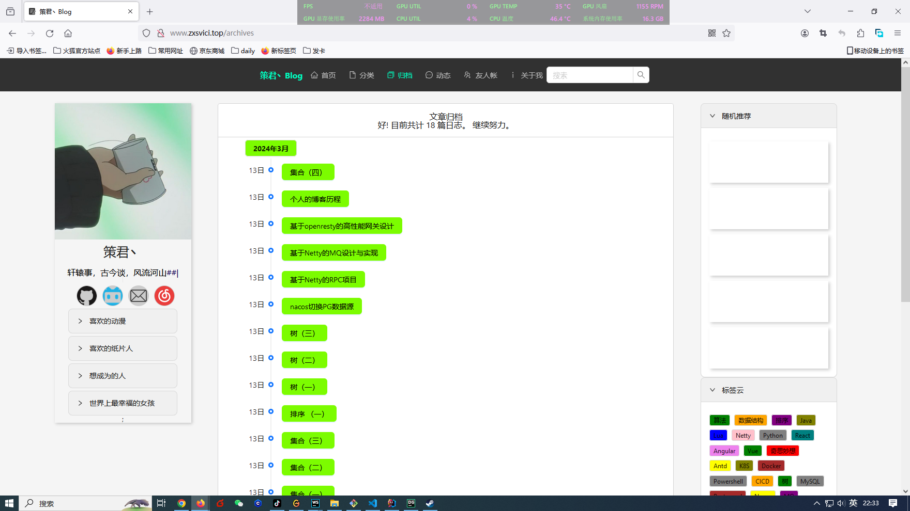
### 友人帐
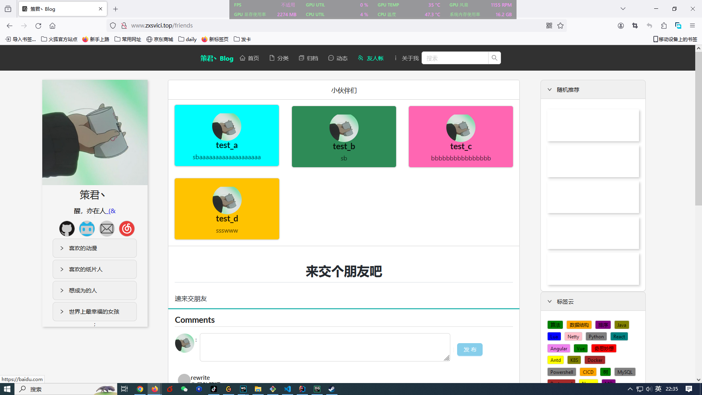
### 博主信息
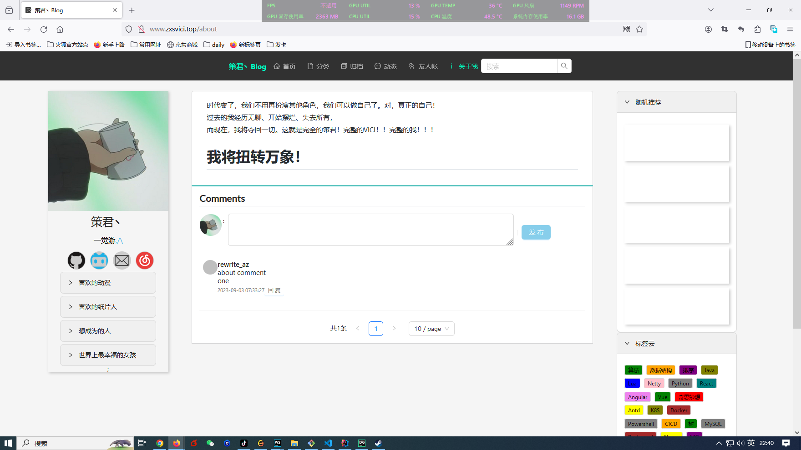
## 后台
- React：主题框架
- antd：整体组件UI
- axios：请求工具
- markdown-it：md文件转化html展示
- react-markdown-editor-lite：md编辑组件
### 首页
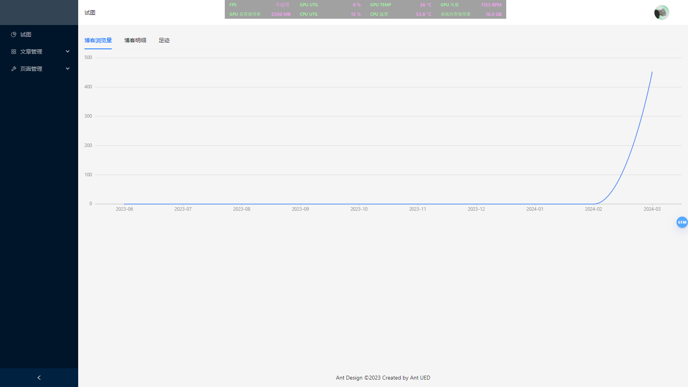
### 写博客
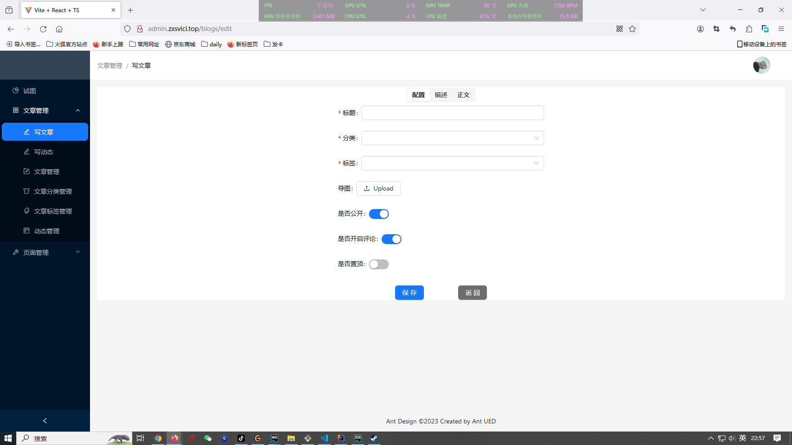
### 写动态
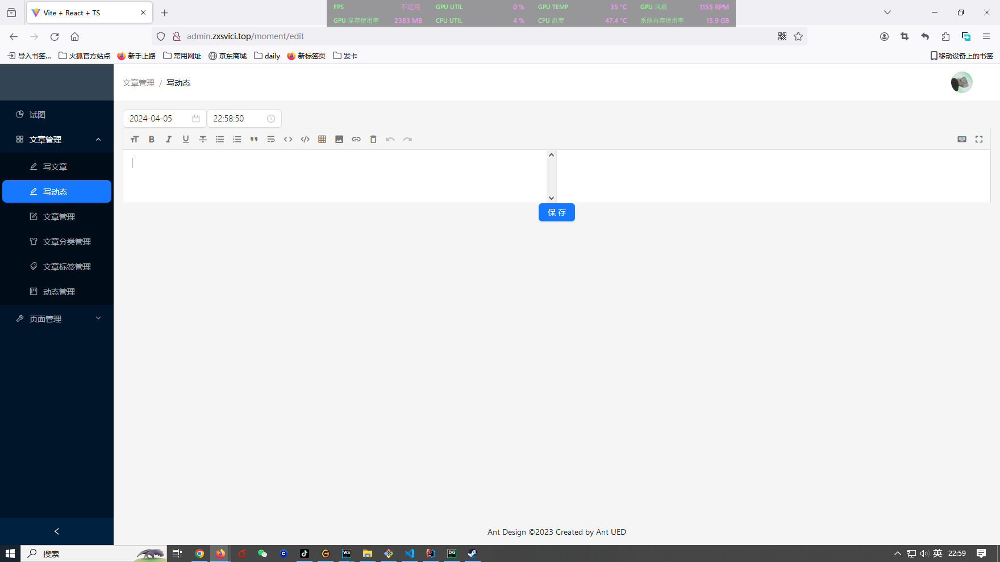
### 文章管理
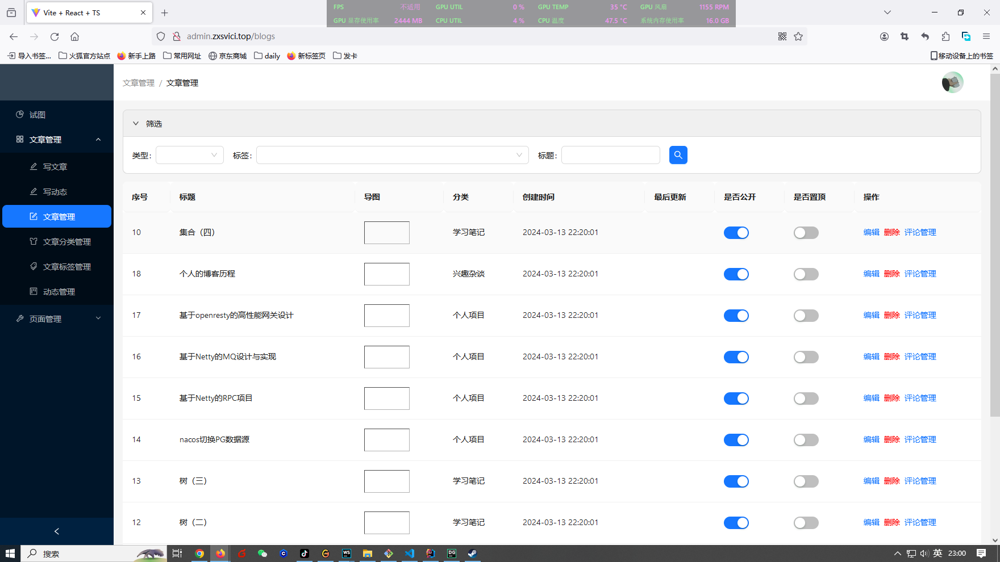
### 评论管理
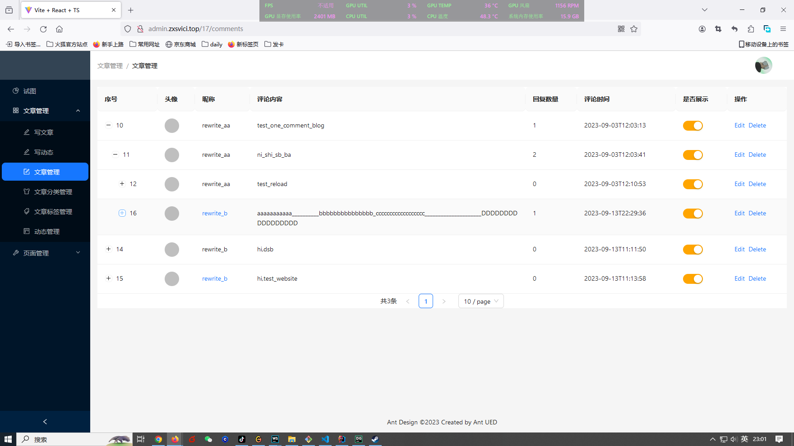
### 分类管理
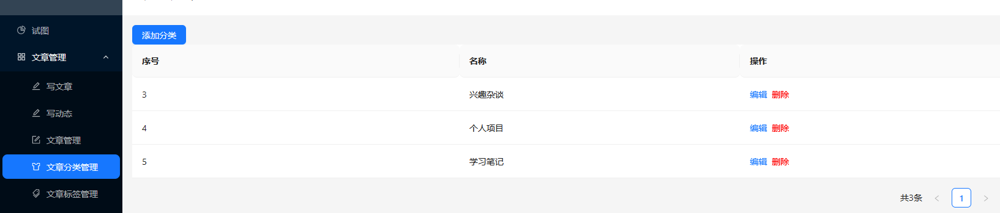
### 标签管理
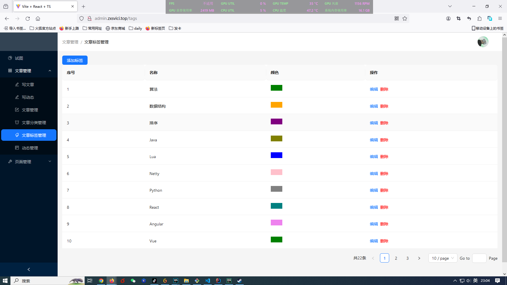
### 站点配置
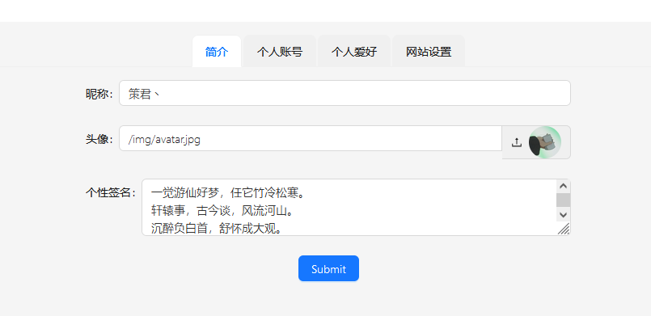
### 友链配置
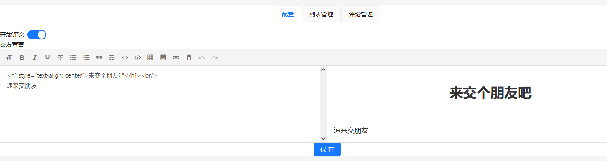
### 个人信息配置
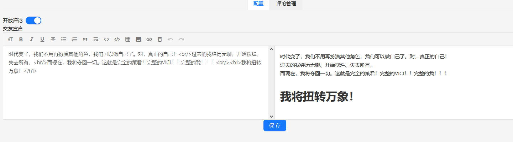